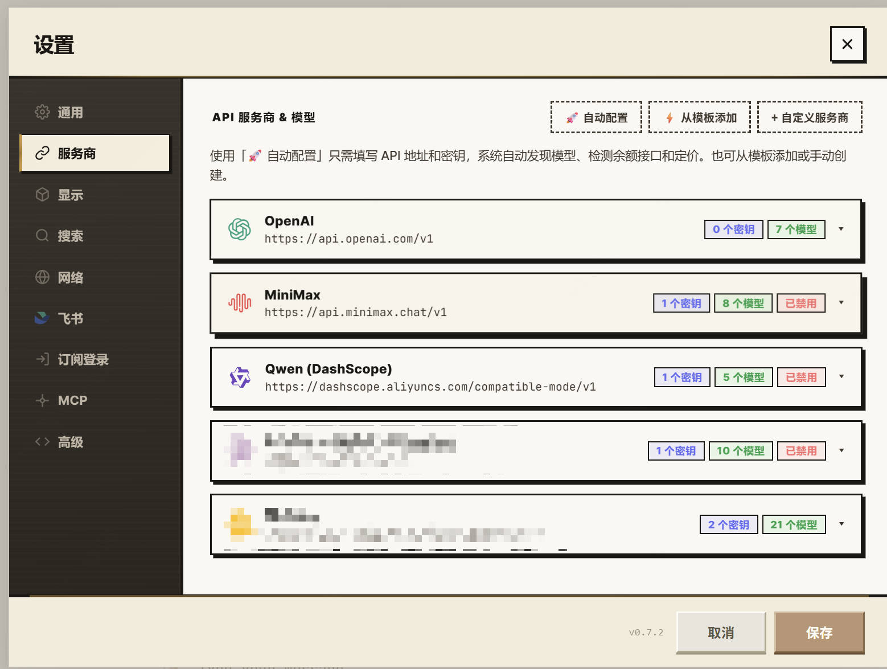

<p align="center">
  <br/>
  <br/>
  <sub>豆腐 — Self-Hosted AI Assistant</sub>
</p>

<p align="center">
  <a href="https://github.com/rangehow/ToFu/actions/workflows/ci.yml"></a>
  
  
  
  
</p>

<p align="center">
  <a href="README_CN.md">🇨🇳 中文文档</a>
</p>

<p align="center">
  
</p>

---

## What is Tofu?

Tofu is a **fully self-hosted AI assistant** you run with a single command. It connects to any OpenAI-compatible LLM and gives you a complete AI workspace — from simple Q&A to autonomous multi-step agents that can search the web, edit your codebase, read papers, control your browser, and collaborate as a team of specialist agents.

Everything runs on your machine. Your data never leaves your infrastructure. One command and you're live.

**What makes Tofu different:**

- **One command, everything included** — the installer sets up the runtime, dependencies, database, and browser engine for you. No Docker required (though it's supported), no manual database setup, no config files to hand-edit.
- **Bring any model** — OpenAI, Anthropic, Gemini, DeepSeek, Qwen, GLM, local models via Ollama/vLLM, or even your existing **Claude Pro/Max / ChatGPT subscription** logged in directly. Add several keys and Tofu rotates and load-balances across them automatically.
- **A real agent, not just a chat box** — it can run multi-step tasks on its own: search, read, write code, run commands, generate images, and check its own work with a Planner → Worker → Critic loop.
- **Truly yours** — self-hosted, MIT-licensed, no telemetry. Your conversations, keys, and files stay on your infrastructure.
- **Everything is also an API** — every feature in the UI is a documented HTTP endpoint, so you can script Tofu or plug it into other tools (see [Headless API](#headless-api)).

> **Looking to drive Tofu from an AI agent or coding assistant?** This README is written for *people*. There's a separate set of machine-facing materials — see [For AI Agents & Developers](#for-ai-agents--developers) at the bottom.

---

## Quick Start

Pick the row that matches your OS. Each one ends with a running server on **http://localhost:15000**.

| OS | What to do |
|---|---|
| **Windows** | Download **`Tofu-Setup-x.y.z-win64.exe`** from the [latest release](https://github.com/rangehow/ToFu/releases/latest) and double-click. |
| **Linux / macOS** | `curl -fsSL https://raw.githubusercontent.com/rangehow/ToFu/main/install.sh \| bash` |
| **Docker** | `git clone https://github.com/rangehow/ToFu.git && cd ToFu && docker compose up -d` |

> **macOS — prefer a click-to-run app?** Instead of the `install.sh` line above, download the `.dmg` from the
> [latest release](https://github.com/rangehow/ToFu/releases/latest) and pick the build for your chip:
> **`Tofu-*-macos-arm64.dmg`** for Apple Silicon (M1/M2/M3…) or **`Tofu-*-macos-x86_64.dmg`** for Intel Macs.
>
> **Adding another machine to an existing server?** You don't have to go back to GitHub at all: a running
> Tofu server hosts the installers itself. Open **Local Control** in the app (the desktop row) and the
> download button serves the right installer for that machine straight from your server — mirrored from the
> latest release in the background (Windows/macOS) or built on the server itself (Linux/Windows, from the
> committed tree via `POST /api/v1/desktop/build`). Same file, no dependence on the public GitHub network.
>
> There are two components — pick by the machine's role:
>
> | Component | For | Size | Contents |
> |---|---|---|---|
> | **Agent (TofuAgent)** | The server should act on this machine (incl. subscription-traffic egress) | ~53 MB | Role window + control panel (bilingual zh/en); tray mirrors it; optional start-with-Windows |
> | **Full desktop (Tofu)** | This machine also runs Tofu itself (server + client in one) | ~153 MB | Full server + browser UI + role window + tray |
>
> Local Control puts the right one first for your situation; the Releases page carries both
> (`TofuAgent-Setup-*` / `Tofu-Setup-*`).
>
> Both components open a small **role window** at launch — the full app says "this computer runs your Tofu
> server", the agent says "this computer is controlled by a Tofu server" — which doubles as the control
> panel (permissions, connect line, start-with-Windows), so nothing important hides in the tray anymore.
> Uncheck "Show this window at startup" to go straight to the tray; the tray keeps a **Control panel…**
> item to reopen it.

That's it. Each path handles the runtime, dependencies, the database,
the browser engine, and starts the server — no flags, no follow-up
steps. On Linux/macOS the installer uses a fast [uv](https://github.com/astral-sh/uv)
path (prebuilt wheels, ~1–2 min) and falls back automatically to conda on
older systems (glibc < 2.28); pass `--use-conda` to force conda. The
default storage backend is **SQLite** (zero-config, WAL); PostgreSQL is an
equal, explicit `TOFU_DB_BACKEND=postgres` option. Both run behind the same
project-local Storage Sidecar, and an unavailable selected backend fails
closed rather than switching engines. See
[the storage contract](docs/STORAGE_REDESIGN.md).

For a source checkout, the everyday lifecycle command remains:

```bash
python server.py
```

It now starts or contacts the project-local manager and returns once the one
managed server is ready; running it twice never creates a second instance.
Use `python serverctl.py status|stop|restart|doctor` for operations and
`python serverctl.py logs -f` for the console log. A deliberate `stop` stays
stopped, while crashes and OOM exits are recovered automatically.
Run `python serverctl.py install` once if this checkout should also recover the
manager after a host/session restart; the command safely replaces legacy
`tofu_guard` cron entries without restarting a healthy server.
For production memory isolation, alert thresholds, backup/restore drills and
Kubernetes baselines, follow the [reliability runbook](docs/RELIABILITY_RUNBOOK.md).

> Need to pre-set an API key, change the port, or recover from a failed
> install? See **[docs/INSTALL.md](docs/INSTALL.md)** for all flags and
> troubleshooting recipes.

> **No root or Docker daemon on a Linux benchmark machine?** The optional
> [rootless local VM runner](docs/ROOTLESS_VM_SANDBOX.md) builds QEMU entirely
> below a private user prefix and runs Harbor/Terminal-Bench tasks in disposable
> TCG guests. Public HTTP(S) can be enabled through its restricted proxy; it
> never uses a cloud sandbox or mounts the host project into the guest.

---

## Connect Your LLM

<p align="center">
  
</p>

Click **⚙️ Settings → 🔗 Providers** and add your API keys. Tofu works with any OpenAI-compatible API:

| Provider | Setup |
|---|---|
| OpenAI, Anthropic, Amazon Bedrock, Google Gemini, DeepSeek, Qwen, MiniMax, GLM, Doubao, Mistral, Grok, Baidu Qianfan, OpenRouter | Click **⚡ Add from template** — one click |
| Ollama, vLLM, or any local model server | **Auto-discovered** on startup when serving on its default port (Ollama `11434`, vLLM `8000`, SGLang `30000`) — or add as custom provider with your local endpoint |
| Azure OpenAI | Template available with deployment-specific base URL |

**Multiple keys per provider** — add several API keys and Tofu automatically rotates between them when one hits rate limits. Across providers, the smart dispatcher routes requests based on real-time latency scoring and error-rate tracking.

**Model catalogues stay current automatically** — a template is only the starting metadata. After you save a provider key, Tofu periodically reconciles the configured list with that account's authenticated `/models` catalogue: newly available models appear automatically, while a missing model is removed only after two consecutive successful snapshots. Network errors or empty responses retain the last-good list, and manually added private deployments are pinned. The per-provider switch in Settings opts out; `TOFU_MODEL_CATALOG_SYNC=0` disables the worker globally.

**Local engine auto-discovery** — Tofu probes the canonical loopback ports (Ollama `:11434`, vLLM `:8000`, SGLang `:30000`, plus `$OLLAMA_HOST`) shortly after startup and every 2 minutes. When an engine answers with a non-empty model list it is registered as a normal local provider automatically — health checks and the Settings card work exactly like a manually added one. Deleting an auto-added provider dismisses its port permanently (no zombie re-adding). Set `TOFU_LOCAL_AUTODISCOVER=0` to opt out.

Or set environment variables for headless/Docker setups:
```bash
export LLM_API_KEY=sk-xxx
export LLM_BASE_URL=https://api.openai.com/v1
export LLM_MODEL=gpt-4o
```

---

## Headless API

Everything you can do in the UI is also exposed as a documented HTTP API, so you can drive Tofu from scripts, agents, or your own apps without rendering the web UI.

**Mounts:**

| Prefix | Surface |
|---|---|
| `/api/v1/*` | Tofu native — full feature parity with the UI (chat, conversations, tasks, agents, capabilities, keys, usage, billing, …) |
| `/v1/...` | OpenAI compat — `chat/completions`, `models`, `embeddings` (drop-in for the OpenAI SDK) |
| `/v1/messages` | Anthropic compat — Messages API (drop-in for the Anthropic SDK) |
| `/metrics` | Prometheus exposition (admin-scoped) |

**Self-description:** `/api/openapi.json` and `/api/openapi.yaml` (OpenAPI 3.1), Swagger UI at `/api/docs`, ReDoc at `/api/redoc`.

**Manage keys** in **Settings → 🔑 API Keys**: mint, scope (`chat`/`admin`/etc.), set per-key RPM and TPD limits, revoke, view a 30-day usage chart per key. Idempotency-Key is supported on POSTs (24-hour cache, salted by principal). Standard rate-limit headers (`X-RateLimit-*`, `Retry-After`) are returned on every response.

**Credential vault** in **Settings → ⚙️ Advanced**: machine/release credentials (GitHub PAT, PyPI token, …) live in one place — Fernet-encrypted under `data/config/` (separate chmod-600 key file), never committed, never shipped by an export. The list shows only a masked hint (`ghp_…3V8`); plaintext leaves the vault only via an explicit, audited reveal and auto-hides after 30 s.

**Client SDKs** ship in [`clients/`](clients/):

```bash
# Python — sync `Tofu` class + `tofu` CLI
cd clients/python && pip install -e ".[cli]"
export TOFU_API_KEY=tofu_admin_xxx TOFU_BASE_URL=http://localhost:15000
tofu chat "hello"

# TypeScript — Node 18+, browsers, Cloudflare Workers, Vercel Edge, Deno, Bun
cd clients/typescript && npm install
```

Or use any OpenAI / Anthropic SDK directly by pointing it at your Tofu base URL with your `tofu_admin_*` key as the API key.

---

## Multi-Tenant Relay (paid mode)

When `auth_mode=multi-user`, Tofu turns into a **paid AI relay station** — one self-hosted instance, many users, each with their own wallet, billed against your upstream LLM costs.

**What lights up automatically when you flip the mode** (no-op in `open`/`private`):

- **Per-user wallets** in micro-credits (1 credit = 1,000,000 µ ≈ US $0.001), backed by an append-only ledger as the source of truth — no floats, no rounding bugs.
- **Atomic reserve / settle** on every chat request — pre-flight 402 on insufficient funds, post-flight settlement of actual token usage; a background janitor sweeps stale reservations every 30 minutes.
- **Customer pages** — `/login`, `/signup`, and `/dashboard` (Wallet, Keys, Usage, Docs, Account). Signup gating + welcome credit in `data/config/relay.json`.
- **Payments** — Stripe webhooks and Alipay async-notify, idempotent on `(provider, provider_id)`. Configure credentials in `data/config/payments.json`.
- **Redeem codes** — generate batches, hand them to users, redeem to wallet.
- **Pricing table** — per-model unit prices (input/output/cache) hot-reloaded from `data/config/pricing.json`, with family-prefix fallback and an admin-tunable margin.
- **Admin console** — a standalone **`/admin`** dashboard (Users, Pricing, Redeem Codes, Payments) reachable only with an `admin`-scoped key under multi-user mode.

Everything is implemented in `lib/billing/` and `routes/api_v1/billing.py`; switch back to `open` or `private` and the tables stay empty, the customer pages stop being served, and the gate behaves as in the previous section.

---

## Features

### 💬 Chat with Any Model

<p align="center">
  
</p>

The core experience: pick a model from the dropdown, type a message, get a streaming response. But Tofu goes much further than a basic chat UI.

**When you want to try different models on the same question** — switch models mid-conversation. Each message remembers which model generated it, so you can compare outputs naturally. Branch any assistant message to explore alternative responses from different models or with different parameters, all in the same thread.

**When you're working in Chinese but need English sources** — enable auto-translation per conversation. Your Chinese questions are translated to English for the model, and the English response is translated back. The original is always preserved — click to toggle. For faster, cheaper translation, connect a dedicated [machine translation provider](#-machine-translation) instead of using the LLM.

**When conversations get long and you lose context** — Tofu's 3-layer compaction pipeline handles this automatically:
1. **Micro-compaction** (zero cost): old tool results are replaced with summaries, keeping only the recent "hot tail"
2. **Structural truncation**: thinking blocks, oversized arguments, and redundant screenshots are trimmed
3. **LLM summary** (force-triggered): when context pressure is high, a cheap model evaluates each turn for relevance and compresses accordingly

Agent loops also enforce a **128K-token economic working set** by default, even
when a model advertises a 1M-token window. This bounds the prompt that is paid
for and replayed on every tool round; set `compaction.workingSetTokens` per
request or `TOFU_WORKING_CONTEXT_TOKENS` process-wide (`0` restores the old
window-only trigger). GPT-5.6 Responses requests additionally use a stable
hashed cache namespace, an explicit stable-prefix breakpoint, encrypted
reasoning replay, and stateless server compaction as a safety net.

To evaluate the savings safely, **Settings → Advanced** includes a default-off,
conversation-sticky **Cost Optimization A/B Experiment**. It compares the
compatibility baseline (inline MCP schemas, window-only compaction) with the
current optimized policy, shows each finished turn's arm, and reports
provider-usage × persisted-price cost, pricing coverage, tokens, cache ratio,
latency and an error-free completion proxy. Explicit per-request overrides are
excluded. First enablement is a 10% canary; changing traffic/split for a saved
experiment requires a new ID so old conversations cannot switch arms.
Disabling the switch is an immediate rollback.

**When you want to organize your conversations** — create folders in the sidebar to group related threads. Drag conversations between folders, or leave them unfiled.

**When you'd rather read the reasoning in order** — finished multi-tool replies render as an *interleaved timeline*: each tool call appears inline right next to the thinking and narration that led to it, so you follow the assistant's actions in the order they actually happened instead of three separate "all thinking / all tools / all answer" blocks. On by default; toggle it in **Settings → General → "Per-tool inline timeline."**

**When a conversation runs long** — a **context health bar** shows how much of the model's window you're using, and Tofu automatically **compacts** older turns so the thread keeps going without hitting the limit. You can open the **compaction viewer** to inspect exactly what was summarized, so nothing feels lost.

---

### 🎙️ Voice Input (Speech-to-Text)

When typing is slower than talking — dictate straight into the message box.

**How to use:** Click the **mic button** next to the composer, allow microphone access, speak, then click again to stop. Your speech is transcribed and inserted at the cursor — it's **never auto-sent**, so you review and edit before sending. It's dictation, not a spoken conversation.

**The mic only appears** when your browser supports recording *and* a speech-to-text model is configured — otherwise it stays hidden. To enable it, add a provider whose model has the `transcription` (or `audio_chat`) capability in **Settings → Providers**:

| Provider | Models |
|---|---|
| **OpenAI** | `gpt-4o-transcribe`, `gpt-4o-mini-transcribe`, `whisper-1` |
| **Groq** | `whisper-large-v3-turbo`, `whisper-large-v3` (fast, low cost) |
| **Omni chat models** | Gemini / LongCat and similar, via `audio_chat` |

Optional env tuning: `TOFU_AUDIO_MAX_BYTES` (default 25 MB), `TOFU_AUDIO_MAX_DURATION_S` (default 600 s). There's no separate voice tab — availability is driven entirely by the configured model.

---

### 🎬 Video Upload & Analysis

Drop a video into the input box (or pick one via 📎) and ask questions about it — “what does the presenter say about X?”, “summarize this clip”, “find the moment the graph appears”.

**How it works:** the moment you attach a video, Tofu processes it in the background — it samples the video into a strip of timestamped frames (uniform coverage plus scene-cut detection) and, if the video has an audio track, transcribes it through your configured speech-to-text model (the same chain as voice input). When you hit send, the frames + transcript ride the message to any vision-capable model — no special video model required. The processing chip on the attachment shows progress; sending waits for it automatically.

- **Formats** — mp4 / mov / webm / mkv / avi, up to **512 MB / 15 minutes**
- **Model-aware frame budget** — the number of frames sent adapts to the selected model's vision capability, context window and per-request image limits (e.g. Claude's 100-images cap is accounted across the whole conversation)
- **No transcription model configured?** The video still works — the model analyzes the frames alone
- **Chat model has no vision?** If ANY vision-capable model is configured, Tofu narrates the frames into a text storyboard at upload time, so even a text-only model can answer questions about the video
- Click the video card on a sent message to replay the original file

Optional env tuning: `TOFU_VIDEO_MAX_BYTES` (default 512 MB), `TOFU_VIDEO_MAX_DURATION_S` (default 900 s), `TOFU_VIDEO_ANALYSIS=0` to disable the feature entirely. Frames are extracted with the built-in ffmpeg (auto-installed via `imageio-ffmpeg` if absent).

---

### 🔍 Web Search & Content Fetching

When the assistant needs current information — today's news, documentation updates, API references — it can search the web and read pages.

**How it works:** Enable the 🔍 toggle in the tool bar. The assistant searches across multiple engines in parallel (DuckDuckGo, Brave, Bing, SearXNG), deduplicates results, then fetches and extracts the most relevant pages. A content filter (LLM-powered, optional) strips navigation, ads, and boilerplate.

**When you paste a URL** — the assistant fetches it directly, handling HTML, PDFs, and plain text. For pages behind authentication, use the browser extension instead (see below).

**Configuration** — in **Settings → 🔍 Search & Fetch**:
- How many results to auto-fetch (default: 6)
- Per-page timeout and max characters
- Blocked domains the fetcher should never visit
- Whether to use the LLM content filter (disable for speed)

---

### 🛠️ Tool Calling & Autonomous Agents

This is where Tofu becomes more than a chatbot. When you enable tools, the assistant can take multi-step actions autonomously — searching the web, running code, editing files, generating images — chaining these together to solve complex tasks.

**Built-in tools:**
| Tool | What it does |
|---|---|
| `web_search` | Search the web (multi-engine parallel) |
| `fetch_url` | Read any URL (HTML, PDF, plain text) |
| `run_command` | Execute shell commands |
| `generate_image` | Create or edit images (Gemini, GPT-image) |
| `ask_human` | Pause and ask you a question mid-task |
| `list_conversations` / `get_conversation` | Reference past conversations |
| `create_memory` / `update_memory` / `delete_memory` | Save knowledge for future sessions |
| `check_error_logs` / `resolve_error` | Inspect and resolve errors in project logs |
| Browser tools | Control your browser (via extension) |
| Desktop tools | Control your local machine (via agent) |
| Project tools | Browse, search, edit any codebase |
| Scheduler tools | Create recurring automated tasks |
| Swarm tools | Spawn parallel sub-agents |

**When you need a quick answer with live data** — "What's the current price of NVDA?" The assistant searches, fetches the relevant page, and answers.

**When you need a multi-step workflow** — "Research the top 5 React state management libraries, compare them, and write a recommendation document." The assistant plans the steps, executes searches, reads documentation, and synthesizes the result — all autonomously.

**When the task is too complex for one pass** — enable **Endpoint mode** (Planner → Worker → Critic). A planner rewrites your request into a structured brief with acceptance criteria, a worker executes it, and a critic reviews against the checklist. If the result doesn't pass, the critic sends feedback and the worker iterates — up to 10 rounds.

**When something fails** — the assistant retries with exponential backoff. If the primary model fails entirely, it automatically falls back to a configured backup model and retries.

---

### 💻 Project Co-Pilot

Point Tofu at any codebase and it becomes a coding assistant that can read, search, edit, and run commands in your project.

**Getting started:** Click **Project** in the sidebar, enter the path to your codebase (e.g. `/home/you/myproject`). The assistant gains these tools:

| Tool | What it does |
|---|---|
| `list_dir` | Browse directory structure with file sizes and line counts |
| `read_files` | Read files (supports images, PDFs, Office docs, code — with line numbers) |
| `grep_search` | Search across files with ripgrep (regex, context lines, count mode) |
| `find_files` | Find files by glob pattern |
| `write_file` | Create or overwrite files |
| `edit_file` | Replace text or insert before/after an anchor; supports mixed batches |
| `run_command` | Execute shell commands in the project directory |

**When you need to understand a new codebase** — "Give me an overview of this project's architecture." The assistant explores the directory tree, reads key files, and maps out the structure.

**When you need to fix a bug** — "The login page shows a blank screen after submitting." The assistant greps for relevant code, reads the components, identifies the issue, and applies a focused fix with `edit_file`.

**When you want safe experimentation** — every file modification is tracked per-conversation with full undo support. Click the undo button to roll back any changes the assistant made.

**Multi-root projects** — add multiple directories as roots (e.g. frontend + backend repos). The assistant resolves namespaced paths across all roots.

**Smart token management** — the `content_ref` mechanism lets the assistant write a previous tool result to a file without re-generating it. This saves significant tokens on large files.

---

### 🧩 Project Brain — coordinate many conversations on one project

When you have several conversations open on the same project, the **Project Brain** makes them act like one coordinated team instead of separate, forgetful chats. Each conversation can see what the others are doing, share the same goals and decisions, and avoid stepping on each other's work — and the project can even pick up pending work on its own, all while staying fully visible and controllable by you.

**How you use it:** it's **automatic whenever a conversation is in project mode** (attached to a project folder) — no toggle to flip. You watch and steer it through the slide-in **Project Brain panel**, opened from the project bar (live activity, charter, board, and status tabs), plus a one-line status headline in the collab-bar. The one thing that needs *you*: agents can only *propose* changes to the shared charter — you click **Commit** or **Reject**.

| Capability | What it gives you |
|---|---|
| **Charter** | A shared north-star doc + committed decisions every conversation follows. Changes are human-approved. |
| **Board & epics** | A kanban of claimable workstreams so conversations divide work and don't duplicate it. |
| **Activity feed** | A live pulse of what every conversation is doing right now. |
| **Peer messaging** | One conversation can send another an advisory nudge — rate-limited, never interrupts mid-work. |
| **Path leases** | A conversation reserves the files it's editing so siblings hold off, preventing edit collisions. |
| **Status lane** | Ask the project "where are we? are we drifting?" and get a synthesized answer, plus a watch-list of concerns the brain revisits over time. |
| **Autonomous dispatch** | Idle projects self-start ready, unblocked work with no hand-off. |

---

### 🤖 Multi-Agent Swarm

Some tasks are too big for a single agent. The swarm system lets a master orchestrator plan sub-tasks and delegate them to specialist agents running in parallel.

**When to use it:** "Refactor this microservice into 3 separate services, update the API docs, and write migration scripts." Instead of one agent doing everything sequentially, the master spawns parallel agents for each sub-task.

**How it works:**
1. The master LLM plans sub-tasks and assigns roles (coder, researcher, writer, reviewer…)
2. A **streaming DAG scheduler** launches agents as soon as their dependencies complete — no waiting for entire waves
3. Agents share data through an **artifact store** (key-value pairs visible to all agents)
4. As agents complete, the master reviews results and can spawn follow-up agents
5. Final results are synthesized into a coherent output

**Agent roles** — each agent gets role-specific system prompts, model tiers, and scoped tool access. A "researcher" agent gets search tools; a "coder" agent gets project tools; a "reviewer" gets read-only access.

**Rate limiting** — a shared semaphore prevents agents from overwhelming the LLM API with concurrent requests. Automatic exponential backoff on 429s.

---

### 🌐 Machine Translation

When you translate frequently and want faster, cheaper results — connect a dedicated machine translation provider instead of using the LLM for translation.

**How it works:** By default, Tofu uses a cheap LLM model for auto-translation (which understands context but is slower). When you configure a machine translation provider, all translation requests are routed directly to the MT API — typically **3–5× faster** and **10–100× cheaper** than LLM-based translation, with no prompt overhead.

**Setup:** Go to **Settings → 🌐 翻译 (Translation)**, enable machine translation, and choose a provider:

| Provider | Description | How to get API Key |
|---|---|---|
| **NiuTrans (小牛翻译)** | Chinese MT specialist, supports 300+ language pairs | [niutrans.com/cloud/overview](https://niutrans.com/cloud/overview) |
| **Custom** | Any compatible REST API | Enter your endpoint and credentials |

NiuTrans is the default provider with excellent Chinese↔English quality. Click **"申请 API Key"** in the settings card to register.

**Fallback behavior:**
- **No MT configured** → uses the cheap LLM model (default, works out of the box)
- **MT configured** → uses the MT API; if it fails, automatically falls back to LLM translation
- **Code block protection** → fenced (` ```...``` `) and inline (`` `...` ``) code blocks are extracted before translation and restored after, preventing MT from corrupting code

---

### 🔀 Subscription Login (Claude Pro/Max · ChatGPT)

Already paying for **Claude Pro/Max** or a **ChatGPT** subscription? Log in with it and Tofu uses that subscription as a model provider — no separate API key, billed under your existing plan.

**How it works:** Go to **Settings → Providers** and click **登录 Claude** / **登录 ChatGPT**. Tofu runs a PKCE OAuth flow (`lib/oauth/`), stores the token, and `lib/oauth/outbound.py` bridges the logged-in subscription into a managed provider slot — resolved per-request into a live token plus the required client-identity headers. From then on the subscription behaves like any other provider in the dispatcher (slot rotation, fallback, latency scoring all apply).

- **Claude** requests go to the Anthropic Messages API with the Claude-Code identity headers.
- **ChatGPT (Codex)** requests are auto-converted to the Responses API format.

> This is a normal in-dispatch provider, **not** a CLI subprocess. (An earlier CLI-subprocess "backend switching" mechanism — `lib/agent_backends/` — was removed in 2026-06 in favour of this simpler subscription-as-provider path.)

---

### 🌐 Browser Extension

When you need the assistant to read pages that require login — internal dashboards, JIRA tickets, authenticated admin panels — the browser extension bridges your real browser session to Tofu.

Works in **Chrome, Edge and Chromium** — they are all Chromium-family, so the same extension loads unchanged. (Firefox is not supported: it has no persistent "load unpacked" path — an `about:debugging` add-on is dropped when you restart the browser, and end users can only install add-ons Mozilla has signed.)

**Setup:**
1. Open your browser's extensions page — `chrome://extensions` in Chrome/Chromium, `edge://extensions` in Edge — and turn on Developer Mode
2. Load unpacked → select the `browser_extension/` folder
3. Click the extension icon → enter your Tofu server URL

> Running Tofu on the same machine? Settings → Local Control detects which browser you have and offers a one-click button to open the right extensions page with the folder path already copied.

**What it can do:**

| Tool | Use case |
|---|---|
| `browser_list_tabs` | See all your open tabs |
| `browser_read_tab` | Extract text content (with optional CSS selector) |
| `browser_screenshot` | Capture a visual screenshot |
| `browser_navigate` | Open a URL |
| `browser_click` | Click elements by selector or text |
| `browser_type` | Type into input fields |
| `browser_execute_js` | Run custom JavaScript for data extraction |
| `browser_get_interactive_elements` | Discover clickable/typeable elements |
| `browser_get_app_state` | Access Vue/React internal state |

Clicks do more than click: `text=` fuzzy-matching also hits framework "card" buttons (cursor:pointer regions), and when a click opens a NEW tab the result says so (new tab's id, title, URL) and makes it the working tab automatically — no tab-list round trip needed.

**When the page uses Canvas/SVG rendering** (charts, DAG diagrams) — DOM text extraction returns nothing. Use `browser_screenshot` for visual analysis, `browser_get_app_state` for data, or `browser_execute_js` for custom extraction.

**Multiple browsers** can connect simultaneously with independent command queues — useful if you have work and personal browser profiles.

---

### 🖥️ Desktop Agent

When you need the assistant to interact with your local machine beyond the browser — take full-screen screenshots, read/write local files, automate GUI clicks, manage clipboard.

**Setup:**
```bash
pip install pyautogui pillow psutil
python -m lib.desktop_agent --server http://your-server:15000 --allow-write --allow-exec
```

The agent connects to your Tofu server and exposes tools for file operations, clipboard, screenshots, GUI automation (pyautogui), and system info. All dangerous operations require explicit `--allow-write` / `--allow-exec` flags.

#### Remote Worktree

Let Studio **edit project code on your own machine** (Windows/macOS) — no shared filesystem; only file *intents* are routed to the local agent for execution.

**Journey:**
1. Start the agent on your machine, declaring share roots (the project directories it may touch) — repeatable, persisted to `~/.tofu/desktop_agent.json` so they survive restarts:
   ```bash
   python -m lib.desktop_agent --server https://your-server --allow-write --allow-exec \
       --bridge-secret <token-from-step-2> --root myapp=~/code/myapp
   ```
2. Mint a bridge token under **Settings → Devices** (shown once, scoped to your account — commands only ever reach YOUR devices);
3. In the project picker's **Remote devices** group, add a share root to the workspace (offline devices greyed out);
4. From then on Studio's `write_file` / `apply_diff` / `run_command` land on **your local disk** — snapshot-before-write (`<project>/.tofu/file-history/`, rollback-able), external edits are refused until re-read, and `run_command` output streams live into the terminal block just like server-side runs.

**Safety boundary:** root-relative paths only (symlink/`..`/absolute escapes all refused); delete-command targets must stay inside the root; remote writes default to the Manual approval gate; per-user tokens isolate command delivery on relay deployments. Master switch `TOFU_REMOTE_WORKTREE` (server side) is OFF by default. See `docs/REMOTE_WORKTREE_DESIGN.md`.

---

### 📄 Paper Reader (beta)

When you're reading research papers — arXiv PDFs, conference proceedings, internal whitepapers — Paper Reader turns Tofu into a dedicated research companion.

**How to use:** Click the **📄 Paper** button in the sidebar. The screen splits: **PDF on the left**, **chat + notes on the right**. Upload a PDF or paste an arXiv URL (`arxiv.org/abs/XXXX.XXXXX`) — Tofu fetches, parses, and indexes the full text so the assistant can answer questions grounded in the paper.

**What it does:**
- **Grounded Q&A** — ask "what's the ablation result in Table 3?" or "explain Section 4.2" — the assistant cites the specific passage it's drawing from
- **Paper library** — the left sidebar shows all papers you've read, grouped by date; switch between them without losing conversation context
- **Side-by-side reading** — scroll the PDF while chatting; the assistant sees the page you're on
- **Notes tab** — drop your own notes alongside the paper; they persist across sessions
- **Podcast tab** — turn the paper's analysis report into a listenable solo podcast (~5-min short or ~15-min full). Formulas are told as intuition (never read as symbols), the top figures get a three-beat walkthrough, and every number in the script is machine-traced back to the report before synthesis. Play it in the tab (click-to-seek transcript, sleep timer), download the MP3, or export the script. Requires a report first; without a configured TTS voice slot (`capabilities: ["tts"]` on an OpenAI-compatible `/audio/speech` provider) it degrades gracefully to script + transcript only. See `docs/PAPER_PODCAST_DESIGN.md`.

> ⚠️ **Beta:** Paper Reader is actively being iterated on. Feedback welcome on [GitHub Issues](https://github.com/rangehow/ToFu/issues).

#### Default PDF stack and repair

`install.sh` installs the default rich parser as one exact, compatible trio
(`pymupdf`, `pymupdf_layout`, and `pymupdf4llm`) and runs a real in-memory
Markdown extraction before declaring the install healthy. Check an existing
environment with:

```bash
python scripts/verify_pdf_stack.py
```

If it reports a missing or mismatched package, reinstall the versions pinned
in `requirements.txt` together (not `pymupdf4llm` alone), then rerun the check:

```bash
python -m pip install --upgrade --force-reinstall \
  "pymupdf==1.27.2.3" "pymupdf_layout==1.27.2.3" "pymupdf4llm==1.27.2.3"
python scripts/verify_pdf_stack.py
```

#### Optional: Layout-aware PDF parsing with Docling

The default PDF pipeline (`pymupdf4llm`) does a good job on most papers, but
struggles with **borderless tables** and **complex math formulas** that are
common in ML / theoretical CS papers. For those, Tofu can route through
[**Docling**](https://github.com/docling-project/docling) (IBM) — a layout-aware
model that uses TableFormer for tables and an internal equation model for math,
producing much cleaner Markdown.

**Trade-off:** Docling pulls in PyTorch + ~2 GB of model weights, so it's **opt-in**:

```bash
pip install docling --extra-index-url https://download.pytorch.org/whl/cpu
```

Then enable it by setting `PDF_TEXT_MODE=structured` in your `.env`, or
per-request via the form field `textMode=structured` on `/api/pdf/parse`.
If Docling isn't installed when `structured` is requested, the server falls
back to `pymupdf4llm` automatically — your uploads never break.

---

### 🖼️ Image Generation

When you need visual content — illustrations, diagrams, logos, edited photos — the assistant can generate images mid-conversation.

**How to use:** Enable the 🖼️ toggle in the tool bar and describe what you want. The assistant calls `generate_image` with a detailed prompt.

- **Create from scratch** — "Draw a minimalist logo of a mountain with a sunrise"
- **Edit existing images** — upload an image and say "change the background to a beach sunset"
- **Save to project** — specify `output_path` to save directly into your codebase
- **SVG conversion** — add `svg: true` to auto-trace the generated PNG into a scalable vector

Multi-model dispatch cycles across Gemini and GPT image models, automatically retrying on rate limits.

---
Multi-model dispatch cycles across Gemini and GPT image models, automatically retrying on rate limits.

---

### 📊 Presentation decks (editable PPTX)

Ask for a deck from a topic and Tofu builds an editable PowerPoint without depending on the Kimi website or editor. The pipeline researches URL-grounded fact cards, plans the whole deck's narrative and layout rhythm, generates required hero visuals before page authoring, renders page previews, reviews both individual pages and a whole-deck contact sheet, then exports native PPTX.

- **Deck-first creative plan** — every page receives a narrative role, a named layout archetype, density, adjacent-page context, and an asset obligation; consecutive content pages cannot silently collapse into the same card template
- **Grounded and time-aware claims** — decks and topic videos share one evidence kernel: factual topics concurrently search a current-status lane, official-source candidates, and evergreen background; deck freshness is one month while news video uses one week with an evergreen fallback; cards retain publication date, query lane, and research cutoff, cross-host price consensus is separated from single-source snippets, and the same current-fact gate rejects content that ignores or contradicts release/presale/price evidence
- **Asset-first authoring** — every required editorial image names the exact judgment or visible object it must support, then is generated and cached before a page is written; validation rejects a page that ignores its prepared visual
- **Whole-deck QA** — a labelled contact sheet checks identity consistency, layout repetition, and asset relevance; per-page VLM review traces every callout line to its visible endpoint so labels cannot point at the wrong object or part; Chromium measures real glyph line boxes with a PowerPoint font-metric reserve, catches overflow, text collisions, and later images covering text, then feeds exact element IDs into a minimal repair loop
- **Native deliverable** — text, shapes, tables, charts, and images remain editable in PowerPoint/WPS; fixed text bounds default to native shrink-to-fit, source indentation cannot become phantom paragraphs, and fonts are minimally subset-embedded by actual characters and regular/bold/italic slot; later chat instructions can re-author and re-export one page

---

### 🎬 Motion Video (MG animation)

Turn a subtitle transcript (SRT) into a vertical MG-animated video — Tofu storyboards the transcript into scenes, authors a HyperFrames HTML animation per scene, renders each scene in headless Chrome, and stitches `final.mp4`. No external agent CLIs, no video editor.

**How to use:** Attach a project (Studio), paste an SRT (or a topic to narrate), and ask for a video — e.g. "turn this transcript into a vertical short video". The assistant works under `.tofu/motion_video/<slug>/` and reports the final MP4 path.

- **Source-linked topic scripts** — topic videos use the same time-aware research bundle and current-fact gate as presentation decks; every factual beat keeps its supporting `S#` IDs through `scenes.json`, while the silent end card remains attribution rather than a substitute for shot-level grounding
- **Deterministic renders** — every frame is computed from its timestamp (seekable GSAP timeline); re-render just one scene and re-concat when a single shot looks off
- **Structured shot recipes** — every scene gets a renderer-neutral `motion-shot-v1` contract: narrative role, one of 13 proven recipes, motion family, energy, duration range, phase count, resolved-state hold, QA anchors, constraints, signature move, and transition intent; the matching HyperFrames blueprint body is injected before authoring, while adjacent auto-planned shots avoid repeating the same motion grammar
- **Real overlap transitions** — `motion-timeline-v1` separates spoken content duration from visual handles: push, wipe, and dissolve are real FFmpeg `xfade` overlaps while the final duration, subtitle clock, and narration clock stay unchanged; the scene panel exposes the actual transition and duration
- **Asset-first scenes** — required subject/diagram briefs name a concrete semantic target (the visible object, part, or relationship that supports the line), are generated and cached before composition authoring, and the quality record flags prepared files that the HTML never uses
- **Recipe-aware temporal visual QA** — each recipe chooses four meaningful timeline anchors (setup / peak / settle / resolved hold); capture waits for fonts and every image to decode, then the vision reviewer sees the contact sheet with the shot's semantic constraints, exposing blank openings, wrong mid-animation evidence, collisions, and unfinished settles instead of reviewing one arbitrary final frame
- **Zero-LLM quality gates** — storyboard timeline validation (full coverage, duration sum ±0.1s), HyperFrames lint/validate/inspect before every render, and ffprobe spec checks (resolution / fps / duration / silence) after
- **Self-bootstrapping toolchain** — `motion_video_env_check` installs the pinned HyperFrames CLI on first use; ffmpeg comes from `imageio-ffmpeg` and ffprobe from a static build (both no-root); Chrome reuses the Playwright cache
- **Failure classification** — render errors come back categorized (`env_missing` / `lint` / `chrome` / `timeout` / `aborted`) with upstream fix hints instead of raw logs
- **Professional audio timeline** — `motion_video_narrate` establishes real TTS timing; optional `motion-audio-v1` adds licensed, source-traceable, content-hashed local BGM/SFX at film level, with action-peak, scene-progress, or verified-beat targeting, narration-driven BGM ducking, target loudness, and a delivered attribution manifest; without TTS it can still make a silent or BGM/SFX-only film
- **Headless API + parallel rendering** — `POST /api/v1/motion/videos` runs the whole pipeline server-side (normalized film plan + per-scene authored compositions, bounded-parallel scene renders, dedup-join on repeat requests) and serves the result over Range-enabled `/api/v1/motion/videos/<id>/file` with an aligned sidecar SRT
- **Single-scene regen + burn-in** — re-render just one shot and re-assemble (`POST …/scenes/<id>/regen`, stable final URL), list per-scene status (`GET …/scenes`), and optionally hard-burn subtitles (`burn_in: true`, libass, CJK fonts supported)
- **Paper video abstract** — one call turns a paper report into a short narrated MG video (`POST /api/v1/paper/video/start`, report-gated like the podcast chain)
- **Paper "Video" tab** — the paper reader's fifth tab: generate card (lang/quality/voice/narration/burn-in), live phase progress, an inline player, and a per-scene grid where every shot exposes its recipe/energy/real transition beside its preview and re-render button; audio attribution is downloadable, while `GET /api/v1/motion/shot-recipes` and `/audio-contract` expose the shared contracts for future studios and renderer adapters
- **Deep knowledge packs** — the 29 motion rules, 13 scene blueprints, and 20+ design frame presets from vibe-motion/auto-motion are one click away in Settings → Skills (search "hyperframes")

---

### 🎨 Artifacts (live canvas)

When the assistant produces something you'd rather *see* than scroll past — a full HTML page, an SVG diagram, a React-style snippet, or a long document — it becomes an **Artifact**.

**How it works:** A clickable chip appears next to the message; open it and Tofu renders the content live in a side panel — HTML/SVG in a sandboxed iframe, Markdown safely sanitized. Every artifact is versioned, so you can flip between revisions, **pin** favorites, browse them all in the per-conversation **library**, and **export to PDF**. Great for building a small web page, a chart, or a formatted report and iterating on it in place.

---

### 🔗 MCP (Model Context Protocol)

When you want to connect external tool servers — GitHub, databases, custom APIs — MCP bridges them into Tofu's tool system.

**How it works:** MCP servers run either as local subprocesses (stdio) or as remote HTTP endpoints (`streamable-http` / `sse`), all speaking JSON-RPC 2.0. Tofu translates their tools into OpenAI function-calling format, so the LLM can discover and invoke them alongside native tools.

Large catalogs use **progressive disclosure** automatically: up to 16 MCP tools
stay inline; above that, the request carries only three stable tools for catalog
search, read-only calls, and write calls. Search returns the exact schema only
when needed, while read/write annotations continue to control parallelism and
approval. Override with `mcpToolExposure=inline|progressive|auto` and
`mcpInlineToolLimit`, or the matching `TOFU_MCP_TOOL_EXPOSURE` /
`TOFU_MCP_INLINE_TOOL_LIMIT` environment variables.

**Setup:** Go to **Settings** or configure in `data/config/mcp_servers.json`:
```json
{
  "github": {
    "command": "npx",
    "args": ["-y", "@modelcontextprotocol/server-github"],
    "env": { "GITHUB_TOKEN": "ghp_xxx" }
  }
}
```

A **remote** server that authenticates with a header or a query parameter keeps its
secret in `env` — `headers` and `url` hold only `${VAR}` references, which are
substituted at connect time. That way credentials live in exactly one place and
are redacted out of every API response and log line:
```json
{
  "rollinggo-hotel": {
    "transport": "streamable-http",
    "url": "https://mcp.rollinggo.cn/mcp",
    "headers": { "Authorization": "Bearer ${ROLLINGGO_API_KEY}" },
    "env": { "ROLLINGGO_API_KEY": "your-key" }
  },
  "amap-maps": {
    "transport": "streamable-http",
    "url": "https://mcp.amap.com/mcp?key=${AMAP_MAPS_API_KEY}",
    "env": { "AMAP_MAPS_API_KEY": "your-key" }
  }
}
```

The assistant can then call tools like `mcp__github__create_issue`, `mcp__github__search_code`, etc. — any MCP-compatible server works.

**Local life & travel (China).** The catalog ships a category of everyday-errand
servers that individual developers can get keys for: **Amap** (routing, nearby
search, weather), **RollingGo** hotels + flights (real bookable inventory),
**Tuniu** (hotels/flights/trains/tickets/cruises/tours with a full booking
chain) and **12306** (train availability, local + no key). **Fliggy** ships as a
Skill instead of an MCP server, so you'll find it under **Settings → Skills**.
Ctrip and Meituan are deliberately absent: their AI platforms are gated to
corporate customers, so a one-click card could not actually work.

---

### ☑️ Daily Reports & My Day

Click the **☑️ My Day** button in the sidebar to open your personal work journal — an LLM-powered daily dashboard.

**When you want to see what you accomplished today** — the LLM reads all your conversations for the day and clusters them into 5–15 coherent work streams (e.g. "Fix image rendering bug", "Deploy staging environment"), marking each as *done*, *in progress*, or *blocked*.

**When you need tomorrow's plan** — the LLM synthesizes 3–8 actionable TODO items from unfinished work. Each comes with a detailed prompt and recommended tool configuration. Click ▶ to launch any TODO as a new conversation, pre-filled and ready to go.

**Calendar view** — month-at-a-glance with per-day conversation counts and cost heatmap. Click any date to view or generate its report.

**To-do management** — uncompleted TODOs carry forward to the next day. Add manual TODOs, toggle done/undone, or launch them as conversations. Cost tracking shows per-day and per-conversation spend in CNY.

**Auto-backfill** — a background scheduler generates yesterday's report on server boot if it's missing, and again daily at midnight.

---

### 🕐 Scheduled Tasks

When you need something to run automatically — daily data pulls, periodic health checks, recurring reports — create a proactive agent that runs on a schedule.

**How to use:** Enable the 🕐 Scheduler toggle and ask: "Run a health check on my API every 6 hours" or "Every morning at 9am, summarize overnight GitHub issues." The assistant creates a cron-like task.

**Task types:** Shell commands, Python scripts, or LLM prompts — all with full tool access.

**Manage tasks:** Click the **SCHEDULER** badge in the top status bar to see all active proactive agents and their recent run logs.

---

### 🔧 Self-Tuning (Daily Optimizer)

Tofu quietly watches how it's performing and proposes small improvements to itself — you stay in control of every change.

**How it works:** A nightly loop analyzes recent runs and drafts proposals (e.g. "block a spammy search domain," "adjust a default"). Click the **OPTIMIZER** badge in the top bar to review each one with its rationale, severity, and confidence — then **approve, reject, revert,** or hit **Run now**. Nothing is applied without your say-so (a small whitelist of safe tweaks can auto-apply, and everything is reversible). Turn it off entirely in Settings.

---

### 🐦 Feishu (Lark) Bot

When your team communicates in Feishu and you want AI assistance directly in group chats — Tofu connects as a Feishu bot via WebSocket.

**Setup:**
1. Create an app at [open.feishu.cn](https://open.feishu.cn/app), enable Bot capability
2. Go to **Settings → 🐦 Feishu** → enter App ID and App Secret
3. The bot auto-connects on server restart

**Features:** Multi-turn conversations with full tool support (search, code, project), slash commands for model/mode switching, and conversation management — all within Feishu's native chat interface.

---

### 🧠 Memory System

When the assistant discovers something useful — a bug pattern, a project convention, your preferred coding style — it can save that knowledge as a **memory** for future sessions.

**How it works:** Project-scoped memories are Markdown files stored in `.tofu/memories/` inside your project; global memories (shared across all projects) live in the server-side store `data/memories/global/`. The assistant creates them proactively or when you ask. Each new task runs a local, metadata-only confidence check and can surface at most two strong matches; the assistant can explicitly search the full corpus when needed. Memory retrieval makes no hidden LLM call.

**Tools:** `search_memories`, `create_memory`, `update_memory`, `delete_memory`, `merge_memories` — the assistant manages its own knowledge base across sessions. Turning Memory off removes both its prompt context and these tools.

**When to use:** "Remember that our API always returns snake_case" — the assistant saves this convention and applies it in all future code generation for this project.

---

### 📚 Skills Store

When you want to give the assistant reusable, packaged know-how — a set of instructions and helper scripts for a specific task — install a **Skill**.

**How it works:** Skills follow the open Claude / OpenClaw / AgentSkills format (a `SKILL.md` plus optional reference files and scripts). Go to **Settings → Skills** to browse a **Catalog** of recommended packs (e.g. Anthropic's docx / xlsx / pdf / skill-creator skills) and **install with one click**, or **drag-and-drop a local `.zip`**. New installs land in the **global** scope by default (usable in every conversation; the header selector can target the current project instead). Installed skills appear under the **Installed** tab, where you can view files, move them between global/project scope, or uninstall. Bundled `install.sh` scripts are surfaced as hints — never auto-executed.

The model sees only a compact index until a task matches. It then calls `load_skill` with the exact id to disclose the guide for that task. “Enabled” is persistent Settings state; loading is not activation state. Skills are user-installed workflows, while memories are model-authored experience notes.

**Key configuration:** A skill that needs an API key (e.g. FlyAI travel) lists the required env vars on its card — click **Set**, paste the value, done. Values live encrypted in the **credential vault** (`data/config/`, chmod 600, never committed, never exported) and are injected into tool subprocesses automatically — no server restart, no pasting keys into chat. Uninstalling a skill removes its vault keys too.

---

### 🔌 Conversation Branching

When you want to explore a different direction without losing the current thread — branch any assistant message.

**How it works:** Click the branch icon on any assistant message. A new branch opens inline, continuing from that point with its own independent history. Multiple branches can stream in parallel. Each branch can use a different model or parameters.

**Use cases:**
- Compare how different models answer the same question
- Try an alternative approach without losing the current one
- Let one branch research while another branch implements

---

### 🐾 Tofu Pet (just for fun)

Switch to the **Tofu** theme and the Tofu mascot itself moves into the project bar — the same isometric cream block as the app's logo, drawn in the same palette. It wanders through a decorative scene with a real walk cycle and moods — thinking while a task loads, celebrating on success, napping at night — and disturbs the scene as it goes (grass parts, the pool ripples, clouds stir). Because it's a block of tofu rather than a creature with limbs, it acts by being SOFT: it squashes as it lands, stretches as it rises, and wobbles when it settles. Drag it along the bar, or click it for a summary of your day. Use the **Scene** button (Meadow / Pool / Sky / Off) in the bar to change its world. It respects your OS "reduce motion" setting. Purely decorative — turn it off any time.

---

## Settings Reference

All configuration is done through the **⚙️ Settings** panel (top-right gear icon). Changes save instantly — no restart needed.

| Tab | What you configure |
|---|---|
| **⚙️ General** | Theme (Dark/Light/Tofu), temperature, max tokens, thinking depth, system prompt, per-tool inline timeline |
| **🔗 Providers** | API keys, endpoints, model lists (incl. transcription/audio models), multi-key rotation, auto-discovery |
| **📦 Display** | Which models appear in dropdowns, default model, fallback model |
| **🔍 Search & Fetch** | Result count, timeouts, character limits, blocked domains, content filter |
| **🌐 Translation** | Machine translation provider (NiuTrans / Custom), API key, endpoint |
| **🌐 Network** | Proxy pool (ordered, scoped: subscription-only / global, automatic failover, credentials vaulted, per-entry connectivity test), bypass domains |
| **🔀 Subscription Login** | Log in to Claude Pro/Max or ChatGPT and use it as a provider |
| **🐦 Feishu** | App credentials, default project, allowed users |
| **🔗 MCP** | Model Context Protocol servers (App-Store catalog + custom) |
| **📚 Skills** | Browse, install, and manage reusable Skill packs |
| **🧠 Memory & Preferences** | Stored memories and your durable preference profile |
| **🔑 API Keys** | Mint/scope/revoke headless API keys, per-key limits, auth mode |
| **`</>` Advanced** | Price overrides, cache management, server info |

> Multi-tenant relay admin (Users, Pricing, Redeem Codes, Payments) now lives in a standalone **`/admin`** console rather than a Settings tab.

### Environment Variables (fallback)

For headless/Docker setups, you can configure via environment variables instead of the Settings UI. Copy the template and edit:

```bash
cp .env.example .env
vim .env   # fill in your values
```

The `.env.example` file documents all supported variables. Key ones:

| Variable | Description | Default |
|---|---|---|
| `LLM_API_KEYS` | Comma-separated API keys | *(none)* |
| `LLM_BASE_URL` | API endpoint | `https://api.openai.com/v1` |
| `LLM_MODEL` | Default model | `gpt-4o` |
| `PORT` | Server port | `15000` |
| `BIND_HOST` | Bind address | `0.0.0.0` (all interfaces) |
| `TOFU_AUTH_MODE` | Force auth mode and lock the UI: `open` / `private` / `multi-user` | *(file-driven)* |
| `TOFU_AUTO_KEY` | Set to `0` to skip first-boot admin-key bootstrap | `1` |
| `TOFU_MODEL_CATALOG_SYNC` | Keep remote provider model lists current; `0` opts out globally | `1` |
| `TOFU_WORKING_CONTEXT_TOKENS` | Economic prompt working-set ceiling; `0` disables it | `128000` |
| `TOFU_MCP_TOOL_EXPOSURE` | MCP schemas: `auto`, `inline`, or `progressive` | `auto` |
| `TOFU_MCP_INLINE_TOOL_LIMIT` | Maximum MCP catalog size kept inline in `auto` mode | `16` |
| `TUNNEL_TOKEN` | **DEPRECATED** back-compat shim — use the API-keys system instead | *(disabled)* |
| `TRADING_ENABLED` | Enable trading module (`1`/`0`) | `0` |
| `PDF_TEXT_MODE` | Default PDF text-extract strategy: `rich` (pymupdf4llm, default), `structured` (Docling; requires `pip install docling`), `fast` | `rich` |
| `PDF_VLM_BATCH_PAGES` | Pages per VLM call when VLM parsing is used (1–16) | `4` |
| `PDF_VLM_MAX_WORKERS` | Cap on concurrent VLM calls (useful on shared keys to avoid 429 storms) | unlimited |

> **Priority:** Settings UI > `.env` file > system environment > defaults. You can also `export` variables directly — `.env` is just a convenience.

---

## Project Structure

```
├── server.py                  Flask app entry, middleware, logging
├── bootstrap.py               Auto-dependency repair (LLM-guided)
├── index.html                 Main chat UI (single-page app)
│
├── lib/                       Core libraries
│   ├── agent_core/            Reusable agent base (run loop, dispatch, TaskRuntime, push, profiles)
│   ├── llm/                   LLM API client package (build_body / stream / cache / diagnostics)
│   ├── llm_dispatch/          Multi-key multi-model smart dispatcher
│   ├── storage/               storage.v1 client + supervisor (no database drivers)
│   ├── storage_sidecar/       exclusive SQLite/PostgreSQL driver + transaction owner
│   ├── database/              repositories migrating to named storage operations
│   ├── tasks_pkg/             Task orchestration & context compaction
│   │   ├── orchestrator/      Main LLM ↔ tool loop (package)
│   │   ├── executor/          Tool execution engine (package)
│   │   ├── endpoint/          Planner → Worker → Critic loop (package)
│   │   └── compaction/        3-layer context compaction (package)
│   ├── tools/                 Tool definitions & schemas
│   ├── swarm/                 Multi-agent orchestration
│   ├── search_bridge.py      Seam to the external `tofu_search` package (web search + fetch)
│   ├── research/             Auto-research pipeline (harvest → survey → ideate)
│   ├── longform/             Long-form research reports
│   ├── motion_video/         Motion-graphics video pipeline
│   ├── production/           Production substrate (stage graph, evidence/content contracts, crash-resume)
│   ├── tts/                  Text-to-speech / narration
│   ├── skills/               User-installed skill packages (AgentSkills format)
│   ├── browser/               Browser extension bridge
│   ├── project_mod/           Project co-pilot (scan, edit, undo)
│   ├── memory/                Memory accumulation system
│   ├── mcp/                   Model Context Protocol bridge
│   ├── feishu/                Feishu bot integration
│   ├── scheduler/             Task scheduling (cron, proactive agents)
│   ├── image_gen/            Image generation (multi-model dispatch)
│   ├── mt_provider/          Machine translation providers (NiuTrans, custom)
│   ├── desktop_agent/         Desktop automation agent (local bridge)
│   └── ...
│
├── lib/conversations/         Project Brain — charter, board, feed, peer messaging, path leases, status lane
├── routes/                    Quart Blueprints + routes/api_v1/ (headless API)
├── lib/billing/               Multi-tenant relay billing (wallet, ledger, pricing, payments)
├── lib/oauth/                 OAuth flows (Claude, Codex, PKCE, token store)
├── lib/optimizer/             Nightly self-tuning loop (analyzer → proposer → applier)
├── clients/                   Headless API SDKs (python/, typescript/)
├── static/                    CSS, JS, icons
├── browser_extension/         Chrome extension (Manifest V3)
├── tests/                     Test suite (unit, API, E2E)
└── data/                      Runtime data (git-ignored)
```

> Tofu runs on **Quart** (async Flask) via **Hypercorn**; existing sync route
> handlers run unchanged in a thread pool.

---

## Platform Support

| Feature | Linux | macOS | Windows |
|---|:---:|:---:|:---:|
| Core chat & tools | ✅ | ✅ | ✅ |
| SQLite Sidecar backend | ✅ | ✅ | ✅ |
| PostgreSQL Sidecar backend | ✅ | ✅ | ✅ |
| Project co-pilot | ✅ | ✅ | ✅ |
| Shell commands | ✅ | ✅ | ✅ (`cmd.exe`) |
| Desktop agent | ✅ | ✅ | ✅ |
| Browser extension | ✅ | ✅ | ✅ |

Smoke test: `python debug/test_cross_platform.py`

---

## Testing

```bash
# All tests
python tests/run_all.py

# Individual suites
python -m pytest tests/test_backend_unit.py
python -m pytest tests/test_api_integration.py
python -m pytest tests/test_visual_e2e.py

# Or via the Makefile (parallelized; tune with JOBS=N)
make test-unit        # fast unit tier
make test-api         # API integration tier
make test-frontend    # Vite/ESM owner, artifact, and serving contracts
make test-all         # everything
```

---

## Auth Modes & Security

Tofu has a tri-state auth model, persisted at `data/config/auth.json` and switchable from **Settings → 🔑 API Keys** (top of the tab):

| Mode | Gate | Use case |
|---|---|---|
| `open` (DEFAULT) | Pass-through; synthetic local-admin context | Personal install, frontend-only, loopback-bound |
| `private` | Bearer / `x-api-key` / cookie / `?token=` required; HTML hint page on `/` | Single multi-device operator |
| `multi-user` | Same gate as `private`, plus per-user wallets + signup pages | Paid relay station serving many users |

**Default bind is `0.0.0.0`** — the API is reachable from the LAN out of the box (the desktop-agent pairing flow depends on it). Pass `--host 127.0.0.1` or `BIND_HOST=127.0.0.1` to bind loopback only; the packaged desktop app does this for itself. With open-by-default auth mode that means LAN reachability without a token — the boot banner warns loudly in that combination, so switch to `private` mode (Settings → API Keys) on untrusted networks.

**Open-mode throttling is exposure-scoped.** The per-IP anti-hammer cap on expensive surfaces (chat / agent / search / generate) auto-arms at 120 req/min only when `TOFU_OPEN_MODE_ALLOW_REMOTE=1` admits unauthenticated remote peers. A loopback-only personal install ships **uncapped** — the only traffic the bucket could ever see is your own tabs and background polls, and ambient UI reads (task polls, status probes) never count even when the cap is armed. `TOFU_OPEN_MODE_RPM=<n>` overrides in both directions (n>0 arms, `0` disarms). Behind a same-host tunnel every visitor presents as `127.0.0.1`, so an IP cap can't tell you from a stranger there — the protection for that shape is `private` mode or an API key, never IP throttling.

**First-boot bootstrap** (private/multi-user only) — when the api_keys store is empty and `TUNNEL_TOKEN` is unset, Tofu mints one `tofu_admin_<hex>` key on startup, prints the plaintext + a one-shot `?token=<...>` URL to stderr, and writes the plaintext to `data/config/.first_run_token` (chmod 0600). Disable with `TOFU_AUTO_KEY=0`.

**Token transports** (priority): `Authorization: Bearer` → `x-api-key` (Anthropic SDK) → `tofu_session` HttpOnly cookie → `?token=` query string (consumed + stripped → cookie, private mode only).

**`TOFU_AUTH_MODE=<mode>`** environment variable locks the mode — the UI radios are disabled and a 409 `error_kind=env_locked` is returned on `PUT /api/v1/auth/mode`.

**Other security notes:**
- No secrets in source — all credentials loaded from environment variables or Settings UI.
- Tool execution — the assistant can run shell commands and edit files; dangerous patterns are blocked, but use with appropriate caution.
- Desktop agent — requires explicit `--allow-write` / `--allow-exec` flags.
- Remote worktrees — Studio can edit project code **on your own machine** (Windows/macOS) without sharing a filesystem: intents are routed to a local desktop agent over the bridge. Start the agent with `share_roots` declared, mint a bridge token under **Settings → Devices** (shown once, scoped to your account), then add a remote root from the “Remote devices” group in the project picker. From then on `write_file` / `apply_diff` / `run_command` land on your local disk — snapshot-before-write under `<project>/.tofu/file-history/`, freshness-gated against external edits, streamed command output, root-confined paths and delete-target guards, and per-user command isolation on relay deployments. Disabled by default via the `TOFU_REMOTE_WORKTREE` master switch. See `docs/REMOTE_WORKTREE_DESIGN.md`.
- `TUNNEL_TOKEN` is a deprecated back-compat shim and prints a warning at boot — migrate to the API-keys system.

---

## For AI Agents & Developers

This README is written for people. If you're driving Tofu from a coding
assistant, building on top of it, or contributing code, the machine-facing
materials live here:

| Document | What it covers |
|---|---|
| [`CLAUDE.md`](CLAUDE.md) | Project intelligence & mandatory rules for AI-assisted code changes (logging discipline, code style, change-approval gates, the frontend/backend boundary). |
| [`JOURNAL.md`](JOURNAL.md) | The project's evolution journal — what was tried, why it changed, current status. |
| [`docs/ARCHITECTURE.md`](docs/ARCHITECTURE.md) | Full directory map + Mermaid architecture diagram (and `docs/architecture.html` for the visual version). |
| [`docs/HEADLESS_API.md`](docs/HEADLESS_API.md) | Complete headless-API reference (the `/api/v1/*`, OpenAI, and Anthropic surfaces). |
| [`docs/CUSTOM_TOOLS.md`](docs/CUSTOM_TOOLS.md) · [`docs/TOOL_PLUGINS.md`](docs/TOOL_PLUGINS.md) | Adding your own tools and plugin blueprints. |
| [`docs/PROJECT_BRAIN.md`](docs/PROJECT_BRAIN.md) | Deep dive on cross-conversation coordination. |
| `/api/openapi.json` · `/api/docs` | Live OpenAPI 3.1 spec + Swagger UI served by a running instance. |

---

## Contributing

See [CONTRIBUTING.md](CONTRIBUTING.md) for the full guide. Quick version:

1. Fork → feature branch
2. `python healthcheck.py && python tests/run_all.py`
3. Submit a pull request

---

## License

MIT
