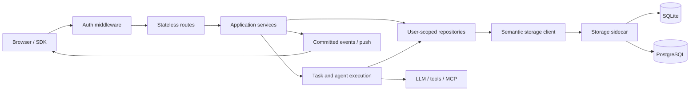

# Tofu architecture

This document is the system map. It names dependency direction and ownership;
domain contracts hold field-level behavior. Start at [the documentation map](README.md)
and follow one domain owner before editing.

## Non-negotiable invariants

1. Authentication and authorization are decided at one middleware boundary,
   default deny. A structured principal with explicit numeric owner identity
   is carried below that boundary.
2. Routes are stateless HTTP adapters. Application services own policy;
   repositories own persistence vocabulary; the storage sidecar owns SQL.
3. A domain has one command path, one durable authority, one event vocabulary,
   and one user-visible error taxonomy.
4. SQLite and PostgreSQL implement the same semantic storage operations.
   Application code never selects SQL by backend.
5. Generated contracts are the source of wire truth. Generated consumers are
   not hand-edited.
6. Every resource has an explicit lifecycle: creation, ownership, cancellation,
   disposal, retry, and failure behavior.

## Runtime topology

The agent kernel has a second composition boundary, not a second execution
implementation. Embedded callers and the lightweight sidecar create explicitly
owned transient tasks and bypass persistence entirely:

```text
tofu_agent embed / sidecar
  → explicit PrincipalContext
  → transient TaskRuntime
  → shared agent execution → providers / tools / MCP
```

That process has no full-application route, repository, storage-sidecar,
billing, or frontend lifecycle. Its state is bounded process memory and cannot
survive restart. See
[DEVELOPER_RUNTIME.md](DEVELOPER_RUNTIME.md). The durable application topology
is:



The web process never opens the application database. The sidecar owns
connections, transactions, schema, maintenance, and backend adaptation. A
selected backend that is unavailable fails closed; runtime does not silently
switch stores.

Personal mode is one `all` process plus SQLite. Distributed mode uses explicit
`api`, `worker`, and `scheduler` roles; every Pod's Sidecar connects to the same
external PostgreSQL authority, while Redis carries only ephemeral leases and
wake hints. `lib/process_roles.py` is the single lifecycle ownership table.

## Layers and dependency direction

| Layer | Owners | May depend on |
|---|---|---|
| Delivery | `frontend/src/`, `routes/`, `tofu_agent/server.py`, SDKs | generated contracts, application services |
| Access boundary | auth/request middleware, `routes/common.py` | identity and policy services |
| Application | domain packages under `lib/` | repository protocols, execution ports |
| Execution | `lib/tasks_pkg/`, `lib/agent_core/`, `tofu_agent/runtime.py`, tools, LLM dispatch | application contracts; semantic storage only for durable composition |
| Persistence | `lib/storage/`, `lib/storage_sidecar/` | schema and backend adapters only |
| Operations | `serverctl.py`, lifecycle modules, health and maintenance | public service/storage ports |

Dependencies point down this table. A lower layer never imports a route or
browser owner. Cross-domain behavior is expressed as an explicit protocol or
committed event, not a call into another domain's private module.

## Request lifecycle

```text
request
  → request ID / authentication / authorization / rate policy
  → schema decode at the route boundary
  → user-scoped application command or query
  → repository semantic operation
  → sidecar transaction
  → typed response or typed error envelope
```

Routes may translate protocol names but do not catch and reinterpret arbitrary
exceptions. The shared error boundary maps known domain/storage errors into the
canonical envelope from [API_CONTRACT.md](API_CONTRACT.md).

## Identity boundary

Public tenant accounts and repository owners are different identifiers. An
opaque `account_user_id` is used for login, account administration, and
billing. A positive integer `owner_user_id` scopes repositories, tasks,
events, caches, and connected devices. `AuthContext` carries both;
`PrincipalContext` projects only the owner into domain code. Neither identifier
is parsed or coerced into the other.

Bearer credentials and account-owner allocation live in the Sidecar identity
domain. Remote device bridges use owner-scoped `agents:bridge` credentials;
there is no shared deployment secret or unauthenticated bridge mode. See
[IDENTITY.md](IDENTITY.md) and
[`contracts/identity_v1.yaml`](../contracts/identity_v1.yaml).

## Conversation lifecycle

Conversation state uses the turn-native v3 protocol only:

```text
generated command
  → ConversationTurnCommandService
  → atomic turn/attempt/change transaction
  → commit acknowledgement
  → wake hint
  → one conversation SSE coordinator
  → one turn reducer
  → renderer projection
```

The snapshot includes revision, settings, turns, attempts, replay cursor, and
heartbeat policy. Push and cross-tab notifications only invalidate; they never
write projection state. See [CONVERSATION_SYNC_V3.md](CONVERSATION_SYNC_V3.md).

Header lifecycle is a separate atomic boundary defined by
`contracts/conversation_lifecycle_v1.yaml`. Delete moves the normalized turn
graph out of the active authority; restore moves it back without executable
attempt state; clone creates a new terminal graph with remapped identities.
Browser-held message arrays are projections and never participate in these
transactions.

## Frontend delivery

New domain code is TypeScript in `frontend/src/`. The retained application shell
is authored as named sections under `frontend/src/runtime/sections/`; styles are
authored under `frontend/src/styles/`. Manifests define deterministic order and
generators produce the large delivery artifacts. Those artifacts are ignored by
normal discovery and must not be edited. See
[FRONTEND_ARCHITECTURE.md](FRONTEND_ARCHITECTURE.md).

## Storage and identity

Repositories accept identity explicitly and expose semantic operations. The
storage client chooses command/query behavior, deadlines, and typed errors; the
sidecar operation catalog chooses transaction mode and backend implementation.
SQL, paths such as `data/tofu.db`, and SQLite/PostgreSQL syntax remain inside
the storage package. See [STORAGE.md](STORAGE.md) and
[modules/data_tier.md](modules/data_tier.md).

## Domain ownership map

| Change | First owner to inspect |
|---|---|
| Boot, process lifecycle, shutdown | [modules/infra_runtime.md](modules/infra_runtime.md) |
| HTTP, auth, providers, billing | [modules/auth_providers_billing.md](modules/auth_providers_billing.md) |
| Conversations and project state | [modules/conversations_project_brain.md](modules/conversations_project_brain.md) |
| Tasks, agents, orchestration | [modules/task_engine.md](modules/task_engine.md), [modules/orchestration_dag.md](modules/orchestration_dag.md) |
| Model dispatch and streaming | [modules/llm_io.md](modules/llm_io.md) |
| Tools, browser, MCP | [modules/tools_execution.md](modules/tools_execution.md) |
| Context, memory, compaction | [modules/context_engineering.md](modules/context_engineering.md) |
| Papers, media, knowledge | [modules/ingest_media.md](modules/ingest_media.md) |
| Scheduling and operations | [modules/scheduling_ops.md](modules/scheduling_ops.md) |
| External APIs and integrations | [modules/integrations_api.md](modules/integrations_api.md) |

## Adding a capability

1. Select the existing domain owner; create a new domain only if no owner can
   express the invariant without reversing dependencies.
2. Define or extend the machine-readable contract.
3. Add an application command/query with an explicit identity parameter.
4. Add semantic repository/storage operations and their transaction rules.
5. Generate consumers and implement the UI through the typed client.
6. Test failure, cancellation, idempotency, ownership, rollback, and cleanup.
7. Update the domain map and authority document; delete superseded paths.

Do not add an adapter that becomes a second implementation. A temporary bridge
must delegate to the owner and carry a concrete deletion condition in the same
change.

## Verification

Use the smallest relevant test, then neighboring contract tests, then broad
gates. The common architecture checks are:

```bash
make docs-check
npm run check:frontend
make suite-health
make test-unit
make test-api
```

The exact testing policy lives in [TESTING_STRATEGY.md](TESTING_STRATEGY.md).
